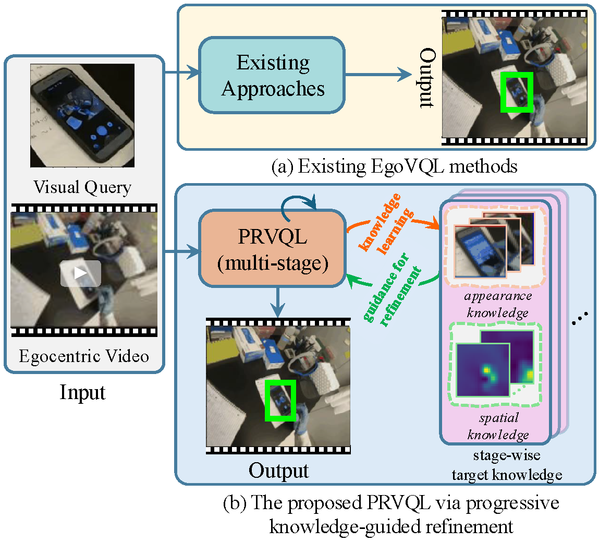
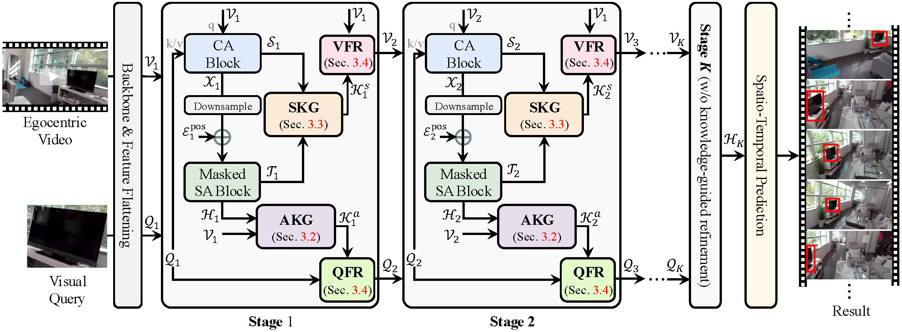

# PRVQL: Progressive Knowledge-Guided Refinement for Robust Egocentric Visual Query Localization

[](https://youtu.be/SoQ0edo6pJo)
[](https://arxiv.org/html/2502.07707v2)

> **🎉 This work has been accepted to ICCV 2025!**

## 📝 Overview

Egocentric Visual Query Localization (EgoVQL) aims to locate a target object in both space and time within first-person videos based on a given visual query. However, existing methods often struggle with significant appearance variations and cluttered backgrounds, leading to reduced localization accuracy.

To overcome these challenges, **PRVQL** introduces a **progressive knowledge-guided refinement** approach. By dynamically extracting and refining knowledge from the video itself, PRVQL continuously enhances query and video features across multiple stages, resulting in more accurate localization.

---

## 🔍 Core Idea

<p align="center">
  
</p>

PRVQL employs **appearance** and **spatial knowledge** extraction modules at each stage to iteratively refine the query and video features. This progressive refinement leads to increasingly accurate localization results.

---

## 🏗️ Model Framework

<p align="center">
  
</p>

---

## ⚙️ Environment Setup

Set up your environment with the following commands:

```bash
conda create --name prvql python=3.8 -y
conda activate prvql

conda install pytorch==1.12.0 torchvision==0.13.0 torchaudio==0.12.0 cudatoolkit=11.6 -c pytorch -c conda-forge

pip install -r requirements.txt
```

---

## 📦 Pretrained Weights

Download the pretrained model weights from [Google Drive](https://drive.google.com/file/d/1A6JTGqG32Ja-4Qo2T44KIcL74hcKEo8T/view?usp=drive_link) and place them in:

```bash
./output/ego4d_vq2d/train/train
```

---

## 📂 Dataset Preparation

### 1️⃣ Process the Dataset
Follow the instructions in the [VQLoC repository](https://github.com/hwjiang1510/VQLoC/blob/main/README.md#download-dataset) to process the dataset into video clips and images.

### 2️⃣ Organize the Dataset
Ensure the dataset is structured as follows:

```plaintext
./your/dataset/path/
└── datav2
    ├── clips
    │   ├── 1.mp4
    │   └── ...
    ├── images
    │   ├── 1   
    │   │   ├── 1.mp4
    │   │   └── ...
    │   └── ...        
    ├── train_annot.json
    ├── val_annot.json
    ├── vq_test_unannotated.json
    ├── vq_train.json
    └── vq_val.json
```

### 3️⃣ Update Configuration Files
Modify the dataset path in the following configuration files:

- `config/eval.yaml`
- `config/train.yaml`
- `config/val.yaml`

Update the dataset root path:

```yaml
root: './your/dataset/path/'
```

---

## 🏋️ Training & Evaluation

We will release the model and code soon.

---

## 📊 Benchmark Results on Ego4D Validation and Test Sets

### 📈 Validation Set

| **Method**            | **tAP$_{25}$** | **stAP$_{25}$** | **rec%** | **Succ** |
|----------------------|--------------|---------------|--------|--------|
| STARK *(ICCV'21)*    | 0.10         | 0.04          | 12.41  | 18.70  |
| SiamRCNN *(CVPR'22)* | 0.22         | 0.15          | 32.92  | 43.24  |
| NFM *(VQ2D'22)*      | 0.26         | 0.19          | 37.88  | 47.90  |
| CocoFormer *(CVPR'23)* | 0.26      | 0.19          | 37.67  | 47.68  |
| VQLoC *(NeurIPS'23)* | 0.31         | 0.22          | 47.05  | 55.89  |
| **PRVQL (Ours)**     | **0.35**     | **0.27**      | **47.87** | **57.93** |

### 🏆 Test Set

| **Method**            | **tAP$_{25}$** | **stAP$_{25}$** | **rec%** | **Succ** |
|----------------------|--------------|---------------|--------|--------|
| STARK *(ICCV'21)*    | -            | -             | -      | -      |
| SiamRCNN *(CVPR'22)* | 0.20         | 0.13          | -      | -      |
| NFM *(VQ2D'22)*      | 0.24         | 0.17          | -      | -      |
| CocoFormer *(CVPR'23)* | 0.25      | 0.18          | -      | -      |
| VQLoC *(NeurIPS'23)* | 0.32         | 0.24          | 45.11  | 55.88  |
| **PRVQL (Ours)**     | **0.37**     | **0.28**      | **45.70** | **59.43** |

---

## 📖 Citation

If you find this repository useful, please consider starring ⭐ it and citing our work:

```bibtex
@article{fan2025prvql,
  title={PRVQL: Progressive Knowledge-Guided Refinement for Robust Egocentric Visual Query Localization},
  author={Fan, Bing and Feng, Yunhe and Tian, Yapeng and Lin, Yuewei and Huang, Yan and Fan, Heng},
  journal={arXiv preprint arXiv:2502.07707},
  year={2025}
}
```

---

